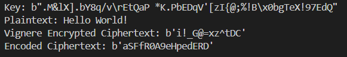
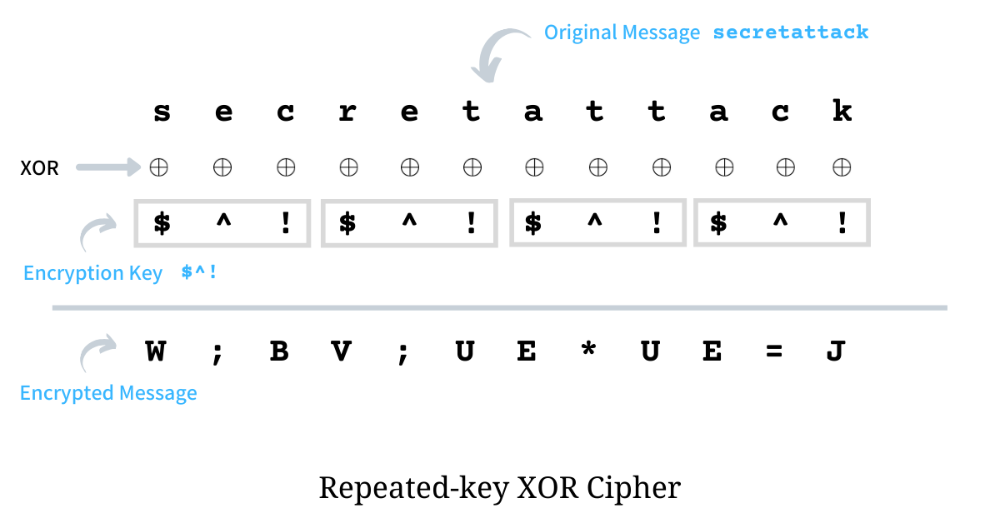
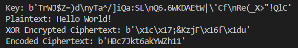
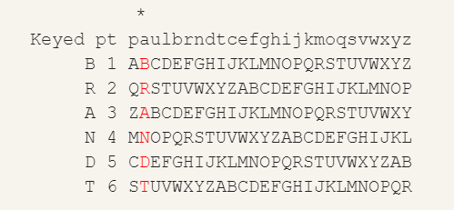
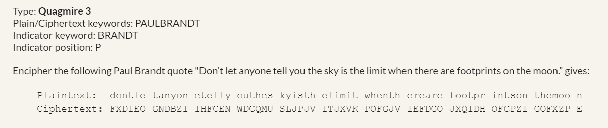
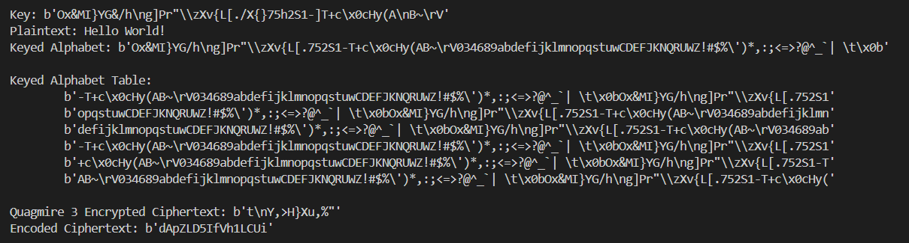

<meta charset="UTF-8" />

# CITS2006 Group Report
## Authors
- Daniel Jennings (23064976)
- Izzy Scott (23105336)
- Elijah Mullens (23335907)
- Joel Willoughby (23135002)
- Mitchell Otley (23475725)
## Overview
Below is a description of our implementation of the project specification to design security solutions for the RapidoBank Filesystem.

This report is separated into each section of the project specification:

- [Yara Engine](#yara-engine)
- [Cipher system and Hashing Algorithm](#cipher-system-and-hashing-algorithm)
- [MTD System](#mtd-system)
- [Dynamic Security Recommendations](#dynamic-security-recommendations)

## Yara Engine
### Brief
The Yara Engine was designed to be as verbose as necessary mainly due to the fact that false positives are always easier to handle than false negatives. It runs over each Yara rule for each file as required, and if a Yara file returns a hit, it will send the required data to VirusTotal for a malicious report. Printing out the needed information to decide if the file is malicious or not.

#### File scanning
As mentioned before files are scanned as required, designed according to the Project sheet. We will run through an example below:   
File name: .hiddensensitivefile.txt
```First Name: Joel
Last Name: Willoughby
Phone Number: 0496496496
Bank Number: 1234567
```
Due to this file being hidden on linux, it will be discovered as such by our is_hidden function:
```Python
#inside yaraengine.py -> is_hidden
return os.path.basename(file_path).startswith(".")
```
Once a hidden file is detected our sensitive information Yara Rule runs over it:
```Bash
#inside sensitiveinfo.yara -> personal_data
$first_name = {(46 | 66) 69 72 73 74 ?? (4e | 6e) 61 6d 65} 
$last_name = {(4c | 6c) 61 73 74 ?? (4e | 6e) 61 6d 65}
```
This will return true - however due to the file containing sensitive information it will not be sent for scanning.
```Python
#inside yaraengine.py -> run_scans
if is_hidden(file_path):
        # Not sending file to be scanned if it contains sensitive information
        scan_file(file_path, "SENSINFO_YARA")
```
Note: If the document is  then caught on another Yara Rule - it will infact be sent for scanning. This is to stop attackers from hiding malicious files as sensitive data.

#### Yara Rules
In this section we will run over every Yara rule.   
- _malURL.yara_  
Very simple yara rule - detects a URL - that is its only functionality  
`$url_pattern = /(http(s)?:\/\/)?[-a-zA-Z0-9@:%._+~#?&\/=]{2,256}.[a-z]{2,6}\b([-a-zA-Z0-9@:%._+~#?&\/=]*)/`
- _malware.yara_   
Has two checks; does it have high entropy, and does it contain base64 content.   
The reasoning behind this is: encrypted files tend to be _very_ random leading to high entropy.   
Encrypted files are also typically base64 encoded, so that they can be transferred over the network without the potential of loss of data (as base64 encodes the data into binary data representable by an ASCII string).
- _netresource.yara_   
This yara rule is too large to mention everything - however it does check the following:   
HTTP Requests   
Network System Calls   
Basic File Access Calls   
Network DLL's   
DNS Calls   
The reasoning behind these is that quite often scripts will be accessing one of these network resources - and as per project requirements we MUST detect network activity.   
We did have a look at a Yara import called `cuckoo` however that has since been deprecated and so we decided against supporting it.   
- _scripts.yara_   
This yara rule looks for common scripting languages and their structure, for example:   
```Powershell
$ps_function = /function\s+\w+\s*{/ // Powershell function
```
This detects the common function structure of a powershell file - which is almost required in any complex powershell script.   
- _sensitiveinfo.yara_   
This detects common sensitive information to be found in a banking files - which was explained above. For example:
```Bash
#inside sensitiveinfo.yara -> personal_data
$first_name = {(46 | 66) 69 72 73 74 ?? (4e | 6e) 61 6d 65} 
$last_name = {(4c | 6c) 61 73 74 ?? (4e | 6e) 61 6d 65}
```
For example this regex detects the string "first name" within a file - with F and N and the space all being non-determinate (f and be capatial or non-capital). Sensitive information also detects Australian bank details, IBAN number and Date of Birth. 

#### VirusTotal Scanning
Using the VirusTotal API, all potentially malicious files and URLs detected by the Yara Engine are sent to be scanned via a request to the VirusTotal API. The engine will save the scan results to a .json file named based on the MD5 Hash of the file. This allows any overseer to further investigate scan results if needed (beyond the handling performed by the MTD). Using the MD5 hash as the naming scheme ensures that each newly scanned file is saved separately. 

## Cipher System and Hashing Algorithm

### Brief
The RB-Cyrpt.py script is designed to be a diverse command line tool to
encrypt, decrypt, and hash the requested file. The CLI tool utilises a set of
flags to differentiate what is happening. An example of how to use the tool is
as follows; 

Say we have a file <b>testfile</b> that we want to <b>encrypt</b>
and <b>hash</b> simultaneously. The encryption algorithm we wish to use is
<b>Quagmire 3</b> while the hashing algorithm is <b>SHA256</b>. We don't have
a key for the encryption, instead we want one generated. The CLI input for this
will be:
```Shell
Security/cryptography/RB-Crypt.py -i testfile -e quagmire -h sha256 --key-gen
```
This will encrypt the file provided by the `-i` flag, then produce a hash of
that file stored in `testfile.hash`. The key used for the encryption will also
be stored in `testfile.key`.

<b>It should be noted that the above script path is the relative path from the
rapidobank filesystem root, any attempts to run it should modify the relative/
absolute path accordingly</b>

A `--help` flag is available to describe how to use the CLI tool.

Additionally, the MTD interfaces with the Cipher and Hashing systems through the classes outlined in cryptoclasses.py, which allows for the creation of `Cipher` or `Hash` instances. As each cipher implemented can use the same key for encryption, each instance of `Cipher` has an allocated key that can be used for symmetric encryption or decryption of files.

### Ciphers
There are 3 ciphers available for the RB-Crypt.py script, which follow the the
`-e` or `-d` flags. The text which follows the flags is case agnostic, however
it must be one of the provided ciphers specified below:
1. <b>Vigenere</b>: called with `vigenere`
2. <b>XOR</b>: called with `xor`
3. <b>Quagmire 3</b>: called with `quagmire`

the `--key-gen` flag is also available to randomly generate a cipher key of
length 50 and store it in a file called `<filename>.key`. Alternatively, if
key-gen is called without any other args it will output the random key to
`stdout`. The content of the key can include any character considered to be printable ASCII by Python's string module. This ensures that the generated key can be displayed properly to the user if necessary.

Each cipher is encoded in ascii encoding, followed by base64 encoding, before being returned. Likewise, the decryption algorithms reverse this process before decrypting to plaintext. This design implementation was chosen such that the encrypted plaintext could be stored or transferred in environments that are restricted to ASCII data, as per [RFC4648](https://datatracker.ietf.org/doc/html/rfc4648). This practice ensures no data is lost in the event that the encrypted data were needed to be transferred to a legacy system.

#### Vigenére Cipher:

The implemented Vigenére cipher is a polyalphabetic cipher. Our implementation uses all ASCII printable characters, as opposed to a traditional Vigenére cipher that uses the A-Z uppercase alphabet. This decision was made to increase ciphertext obscurity and to ensure plaintext maintains it's formatting when decrypted. <br>(e.g. `a` won't get changed to `A`)


<br>
<i>Vigenére Cipher example with an alphabet of A-Z [(source)](https://www.britannica.com/topic/cryptology/Vigenere-ciphers)</i><br>


<br>
<i>Example of our Vigenére Cipher Implementation</i>

#### XOR Cipher:

The XOR cipher works by calculating the XOR value of the plaintext character with a corresponding character in the key, and the XOR value is used as the ciphertext character. As the key is 50 characters, a modulo operation is used such that every 50th plaintext character is XOR’d with the same key character.

<br>
<i>XOR Cipher example [(source)](https://arpit.substack.com/p/deciphering-repeated-key-xor-ciphertext)</i><br>

<br>
<i>Example of our XOR Cipher Implementation</i>

#### Quagmire 3 Cipher:

The Quagmire 3 cipher is one of four iterations of a Quagmire periodic cipher. They are cimilar in principle to a Vignere cipher, except they utilise a keyed alphabet derived from the key. The initial keyed alphabet is decided based on the first appearance of each character in the key, followed by the remaining unused printable ASCII characters. 

Next, we utilise a keyword to formulate multiple keyed alphabets from this initial alphabet. The number of keyed alphabets used is equal to the number of letters in the keyword. So if the keyword is CIPHER, as used in our implementation, 6 keyed alphabets are generated. The variation in the keyed alphabets comes from shifting each alphabet across such that each letter of the keyword aligns with the indicator (the character ‘A’ in our implementation). 

As an example, take the use of the alphabet A-Z, and the key PASSWORD. The initial keyed alphabet would be:

> <span style="color:red">PASWORD</span>BCEFGHIJKLMNQTUVXYZ

We then generate the keyed alphabet table:

>P<span style="color:red">A</span>SWORDBCEFGHIJKLMNQTUVXYZ (Initial Alphabet)<br>
>
>B<span style="color:red">C</span>EFGHIJKLMNQTUVXYZPASWORD (Alphabet 1)<br>
>H<span style="color:red">I</span>JKLMNQTUVXYZPASWORDBCEFG (Alphabet 2)<br>
>Z<span style="color:red">P</span>ASWORDBCEFGHIJKLMNQTUVXY (Alphabet 3)<br>
>G<span style="color:red">H</span>IJKLMNQTUVXYZPASWORDBCEF (Alphabet 4)<br>
>C<span style="color:red">E</span>FGHIJKLMNQTUVXYZPASWORDB (Alphabet 5)<br>
>O<span style="color:red">R</span>DBCEFGHIJKLMNQTUVXYZPASW (Alphabet 6)<br>

In Quagmire 1, the standard ordered alphabet A-Z is rotated to create the table. Quagmire 3 adds a layer of complexity by using the keyed alphabet not only as the initial alphabet, but also the rotated alphabet to create the list of alphabets. To calculate the ciphertext, the plaintext is split into groups of strings equal to the length of the keyword (e.g. groups of strings of length 6 with the keyword CIPHER).

The ciphertext character is calculated by following the process:
1.	Get the index of the character in the initial alphabet
2.	In the assigned alphabet from the list of keyed alphabets (e.g. letter 1 in the group is assigned Alphabet 1), select the character in the same index position

This process is repeated for each character of the plaintext. Note that by changing the key, length of the keyword, letters of the keyword, or the indicator, will all alter the output of the algorithm.

<br>
<i>Example generation of a keyed alphabet [(source)](https://sites.google.com/site/cryptocrackprogram/user-guide/cipher-types/substitution/quagmire)</i>


<i>Quagmire 3 Example (same source)</i>


<i>Our Quagmire 3 Implementation</i>
### Hashes
The hash function can be called in conjuction with or seperate from the cipher
functionality. When called with in conjuction with a cipher flag, the hashing
will take place either before a decryption or after an encryption has occured
on the file. The <b>output file</b> - specified either by `-o` or the
ordinally second un-flagged text - is where the hash will be output to. This
can be mapped to `stdout` with `\&1` or if not output is provided, the output
file will be `<filename>.hash`.

Four hash algorithms have been implemented for RB-Crypt's `-h` flag, those
being:
1. <b>MD5</b>: called with `md5`
2. <b>xxHash</b>: called with `xxhash`
3. <b>MurmurHash</b>: called with `murmur`
4. <b>SHA256</b>: called with `sha256`

To stop unneeded repeated information, I will outline the following:   
Due to these hashes only running to detect file changes, we typically do not need a cryptographically sound hash.
With that in mind:   
xxhash was chosen due to it's incredibly fast speed - it is one of the fastest hashing algorithms available currently - whilst also having a relatively low collision rate.   
murmurhash was chosen as it is also relatively incredibly fast - outpaced by xxhash - however faster than traditional cryptographically secure hashing algorithms.   
SHA256 was included as a safe guard - it is heavy to run compared to the above two - however unlike the above two is cryptographically secure. This hash was included as a safe guard incase the MTD would run into potentially malicious files.   

Speed for all of these can be found here:

https://github.com/Cyan4973/xxHash/blob/dev/README.md#benchmarks

Again the strings are case agnostic and the called with part describes that it
should follow the -h.

### RB-Crypt Format
overall the format for calling RB-Crypt, as specified by the `--help` flag is
```Shell
./RB-Crypt.py [options] [input file] [output file]
```


## MTD System
The MTD system we have impliment will run in a continuous loop that scans every 5 seconds once started until the operator stops the program. We believed this was best to achieve a safer filesystem, as it will be constantly scanning for the following dangers and making the changes necessary to maintain integrity within the filesystem.
#### Yara Alert Raised
Files in the monitored directory are presented to the yara engine for scanning. Files which trigger an alert macthing one or mone of the specified yara ruels are hashed, this hash is then queried against VirusTotal's API to find any previously matched file uploads. If any of these files have never been seen before we upload the file present on our system for scanning. The results from either the hash search or the file upload are checked for vulnerability ratings meeting or exceeding the specifications of the operator. Such files are then moved to a quarantine directory that only the MTD has access and is denied permission to execute. Files which trigger a Yara alert but do not return as meeting or excceeding the threshold, have their hashes added to an exempt list (`whitelist`) so further alerts wont trigger a query against VirusTotal's API. 
- should a scan result in one or more q if a q is triggered the sens directed encrypted ...
#### Changes to the Filesystem
Any files that now come under the exempt list will be catergorised as safe. As a files hash will change as it is modifed or a new hash will be created when a file is added these will not be within the `whitelist`, therefore will be included in the next continous scan done by the MTD assessed by the previous criteria of the YARA rules or operator specified threshold.
#### Passing of Time Interval
As per the project brief the MTD system will change the security settings of the filesystem after a predefined period of time. This results in <b>\<insert what happens here></b>
#### Quarantiner Mode
The following command is apart of the mtd model which allows the operator to interact with the files that are moved and held in the quarantine directory.
`python security/mtd.py quarantiner`
When you enter into this mode there are clearly labeled actions that you can perform upon the files within this directory. 
- `List` the contents of the directory
- `Delete` a quarantined file by its hash
- `Restore` a quarantined file by its hash
- `Quit` the quarantine menu (exit you out of this mode)
## Dynamic Security Recommendations
